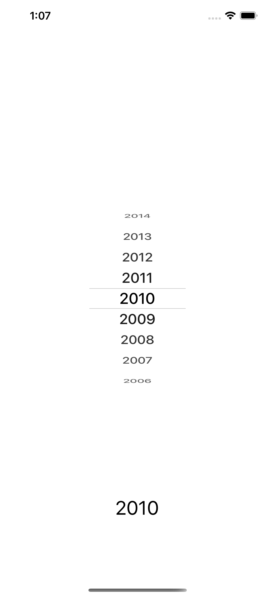
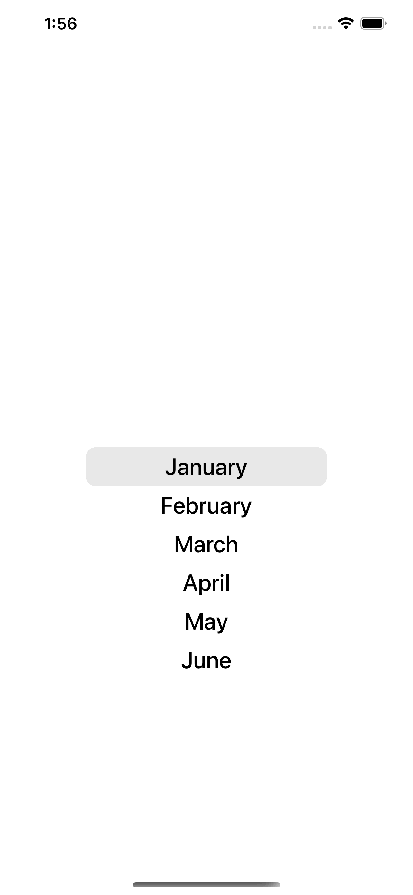

# @wowmaking/react-native-ios-scroll-picker

[](https://badge.fury.io/js/@wowmaking/react-native-ios-scroll-picker)


  |   |    |    |
:---------------:|:----------------:|:-----------------:|:-----------------:|

## Installation

Open a Terminal in the project root and run:

```sh
yarn add @wowmaking/react-native-ios-scroll-picker
```

Or if you use npm:

```sh
npm i @wowmaking/react-native-ios-scroll-picker --save
```

Now we need to install [`react-native-gesture-handler`](https://github.com/kmagiera/react-native-gesture-handler) and [`react-native-reanimated`](https://github.com/kmagiera/react-native-reanimated).

## Usage

```javascript
import * as React from 'react';
import { StyleSheet, Text, View } from 'react-native';
import Picker from "@wowmaking/react-native-ios-scroll-picker";

const start = 2000;
const years = new Array(new Date().getFullYear() - start + 1)
  .fill(0)
  .map((_, i) => {
    const value = start + i;
    return { value, label: `${value}` };
  })
  .reverse();

const App = () => {
  const defaultValue = 2010;
  const [currentValue, setCurrentValue] = useState(defaultValue);

  const handelPickerItemChange = (value: any) => {
    setCurrentValue(value)
  };

  return (
    <>
      <Picker
        values={data} 
        containerWidth={120}
        defaultValue={defaultValue} 
        withTranslateZ={true}
        withOpacity={true}
        withScale={true}
        visibleItems={5}
        itemHeight={32}
        deviderStyle={styles.pickerDevider}
        labelStyle={styles.pickerItemLabel}
        onChange={handelPickerChange}
      />

      <Text>{currentValue}</Text>
    </>
  );
}

export default App;

const styles = StyleSheet.create({
  picker: {
    flex: 1,
    flexDirection: 'row',
    justifyContent: "center",
    alignItems: "center",
  },
  pickerDevider: {
    borderColor: "rgba(0,0,0,0.1)",
    borderTopWidth: 1,
    borderBottomWidth: 1, 
  }
  pickerItemLabel: {
    color: '#000000',
    fontSize: 25,
  }
});

```

## Props

| name                      | required | default | description |
| ------------------------- | -------- | ------- | ---------------------------------------------------------------------------------------|
| values                    | yes      |         | Items Array of { value: number || '', label: '' }                                      |
| containerWidth            | yes      |         | Defines width of gesture container                                                     |
| visibleItems              | yes      |         | Defines how many items will be visible                                                 |
| itemHeight                | yes      |         | Item height                                                                            |
| defaultValue              | no       |    0    | Defines selected item by default                                                       |
| withTranslateZ            | no       |  false  |                                                                                        |
| withScale                 | no       |  false  |                                                                                        |
| withOpacity               | no       |  false  |                                                                                        |
| deviderStyle              | no       |         | Styles for the Devider                                                                 |
| labelStyle                | no       |         | Styles for label Items                                                                 |
